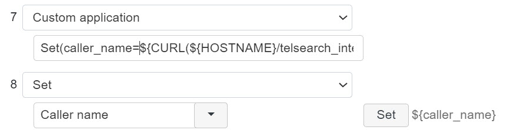

# search.ch integration mit Wildix WMS

### Summary
This integration makes it possible to query the Search.ch number base and optionally save the result in a Wildix address book.

### Dev Log
- 10.06.2024 - Update documentation
- 07.05.2024 - First release

### Install

From WMS console, logged as root.

>apt-get update & apt-get install git -y  
cd /var/www/  
git clone https://github.com/Netkum-AG/telsearch_integration.git  
cd telsearch_integration  
chmod +x main.py  

### Choice of operating mode
- If the API call (see under) is made with 4 parameters, only the search will be performed.  
- If telsearch_phonebook parameter is given, the contact will be automatically saved.

### Lookup mode only
Define the following variables in **Dialplan > General Settings > Dialplan Variables**:
- HOSTNAME / https://xxxx.wildixin.com
- TELSEARCH_KEY / Get a key from https://tel.search.ch/api/getkey
- WMS_APP_TOKEN / Simple token generated from **WMS > Integrations > Applications**

### Lookup + contact save mode
Define the following additional variables in Dialplan Variables:
- TELSEARCH_PHONEBOOK / name of the phone book where to save the contacts. It will be created if non-existing.

### Dialplan change

First, you need to check if the number is already known. 
The easiest way to achieve this it to check if the first digit of the number is a "+".  
We jump out, if this is the case, otherwise the caller name will be overwritten and a new contact created every time (if activated).

Add a custom application and set the caller name from the created variable  

See doc/dialplan_example.json

Debug script for dialplan to be used as custom application
>noop(${HOSTNAME}/telsearch_integration/search.php?request_text=${CALLERID(num)}&telsearch_key=${TELSEARCH_KEY}&wms_hostname=${HOSTNAME}&wms_app_token=${WMS_APP_TOKEN}&telsearch_phonebook=${TELSEARCH_PHONEBOOK})

### Update
From WMS console, logged as root.
>cd /var/www/  
git reset --hard  
git pull  
chmod +x main.py  

### Bug report
Please open an issue on GitHub with as many details as possible and screenshot from the problem.
